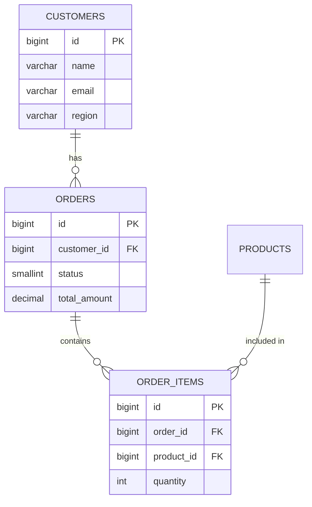

# ERD Builder

Generates text-based Entity-Relationship Diagrams from the connected database's schema. Produces visual box diagrams for the terminal and/or Mermaid syntax for documentation tools.

## When to use

Trigger this skill when the user asks to:
- "Show me an ERD" / "draw a database diagram"
- "What are the relationships between tables?"
- "Visualize the schema" / "relationship map"
- "Generate an ER diagram" / "entity relationship diagram"

If the user only wants a single table's columns, use `schema-explorer` instead.

## Workflow

### Step 1 — Discover all tables

Call `schema_search(pattern="")` to retrieve the full table catalog.

**If >30 tables**, ask the user to scope:
> "This database has N tables. Would you like me to:
> (a) focus on a specific schema,
> (b) focus on tables matching a pattern,
> (c) focus on tables related to a specific table (trace FKs),
> (d) generate the full ERD anyway?"

### Step 2 — Gather columns and relationships

For each table:
1. `schema_lookup(tables=[<name>])` for columns + outgoing FKs
2. `check_cascade(table=<name>)` for incoming FK references

### Step 3 — Ask output format

> "How would you like the ERD?
> (a) **Box diagram** — unicode art for terminal (default)
> (b) **Mermaid syntax** — for markdown/GitHub/Notion
> (c) **Both**"

Default to box diagram if user doesn't specify.

### Step 4 — Build the ERD

#### Format A — Box diagram

```
┌─────────────────┐       ┌──────────────────┐
│   customers     │       │     orders       │
├─────────────────┤       ├──────────────────┤
│ PK id           │◄──────┤ FK customer_id   │
│    name         │       │ PK id            │
│    email        │       │    status        │
│    region       │       │    total_amount  │
└─────────────────┘       └──────┬───────────┘
                                 │
                          ┌──────┴───────────┐
                          │   order_items    │
                          ├──────────────────┤
                          │ FK order_id      │
                          │ FK product_id ───┼──► products
                          │ PK id            │
                          │    quantity      │
                          └──────────────────┘
```

Rules:
- PK columns first, then FK, then data columns
- Max 8 columns per box, show `+N more` if truncated
- Unicode box chars only: ┌ ┐ └ ┘ ├ ┤ │ ─ ┬ ┴
- `◄────` for FK references (many-to-one)
- Group related tables together, hub tables centrally
- When layout is too complex, use boxes + relationships legend:

```
Relationships:
  orders.customer_id      → customers.id        (many-to-one)
  order_items.order_id    → orders.id           (many-to-one)
  order_items.product_id  → products.id         (many-to-one)
  payments.order_id       → orders.id           (many-to-one, ON DELETE CASCADE)
```

#### Format B — Mermaid syntax

````

````

Mermaid rules:
- UPPER_SNAKE_CASE table names
- `||--o{` one-to-many, `||--||` one-to-one, `}o--o{` many-to-many
- Max 8 columns per entity

### Step 5 — Present + summarize

After showing diagram:
```
ERD: N tables, M relationships
Pattern: [star schema | normalized 3NF | denormalized | hub-and-spoke | simple chain]
```

Offer: other format, zoom into cluster, show full column lists.

## Guidelines

- Detect schema patterns (star, 3NF, denormalized) and name them
- Self-referencing FKs: note in legend ("employees.manager_id → employees.id")
- Junction tables: identify and represent as many-to-many in Mermaid
- Large schemas (>15 tables in scope): offer domain-based sub-diagrams

## Safety

Read-only skill. Only queries schema metadata. Never modifies data or schema.
